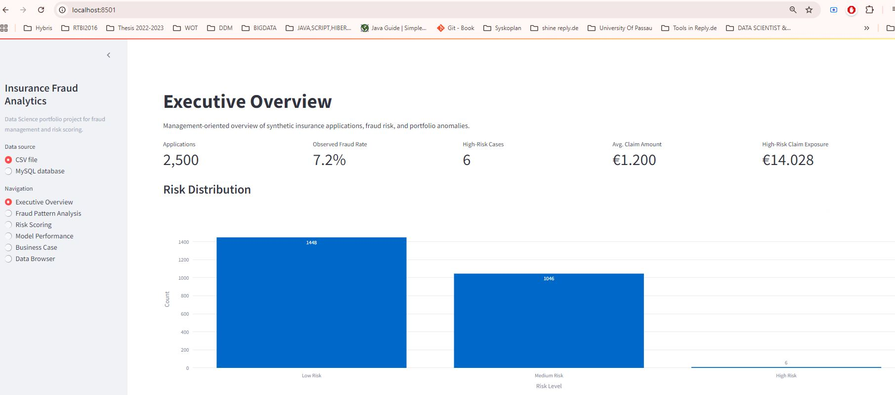
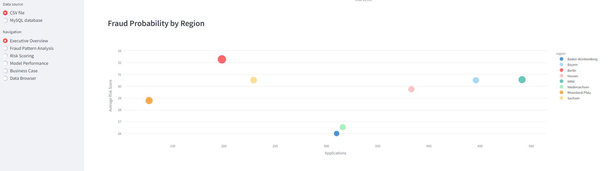
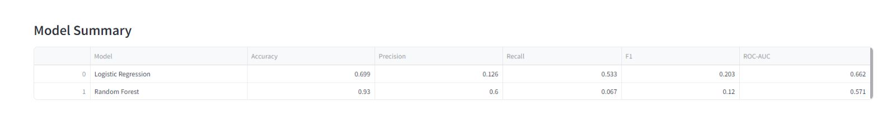
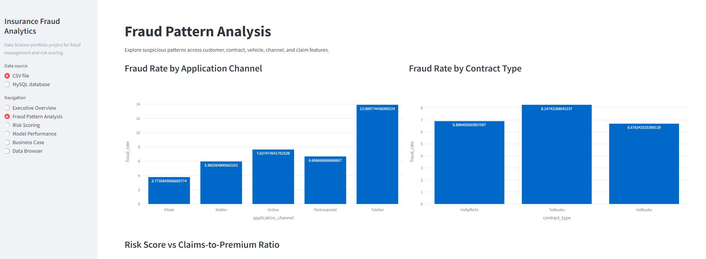
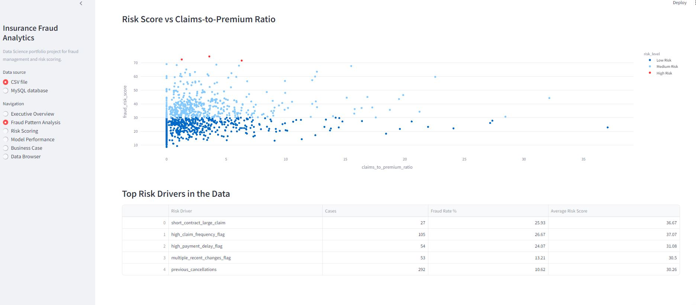
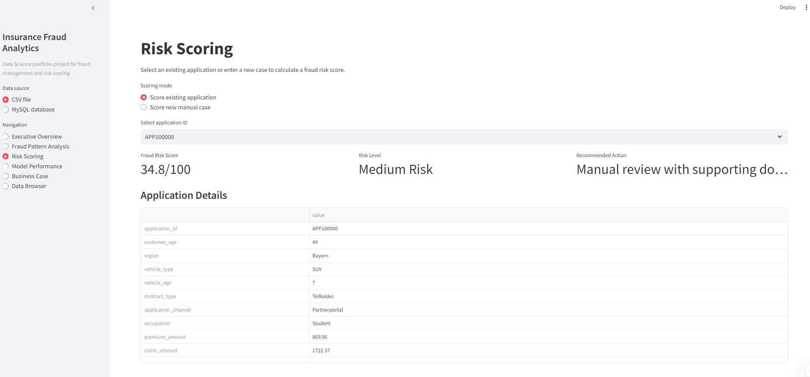
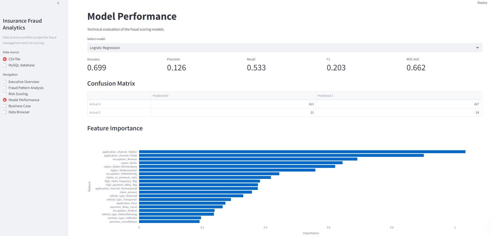
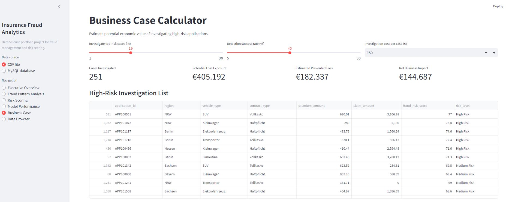
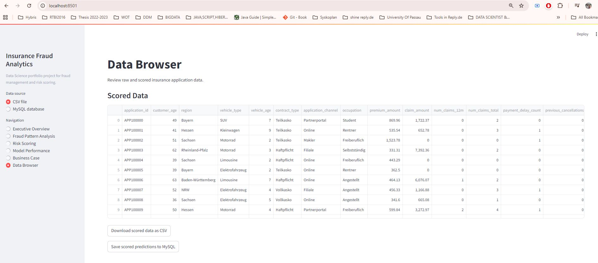

# Insurance Fraud Analytics & Risk Scoring Platform

A Streamlit-based Data Science project for insurance fraud management, anomaly detection, risk scoring, business-case analysis, and management-oriented reporting.

This Sample project was designed for roles such as **Data Scientist – Fraudmanagement & Analytics** in insurance or financial services. It demonstrates Python, SQL, MySQL, Machine Learning, anomaly detection, risk scoring, KPI dashboards, explainability, and business-case thinking.

## Business Goal

Insurance companies need to identify suspicious applications, contracts, and claims early. This app helps analysts and management answer:

- Which applications or contracts have a higher fraud risk?
- Which data patterns indicate suspicious behaviour?
- Which features are driving the fraud score?
- What is the possible financial impact of investigating high-risk cases?
- How can model results be translated into business decisions?

## Features

- Synthetic insurance dataset included as a single CSV file.
- MySQL database setup script.
- Streamlit dashboard with:
  - Executive Overview
  - Fraud Pattern Analysis
  - Risk Scoring
  - Model Performance
  - Business Case Calculator
  - MySQL Data Browser
- Machine Learning models:
  - Logistic Regression
  - Random Forest
  - Isolation Forest anomaly detection
- Metrics:
  - ROC-AUC
  - Accuracy
  - Precision
  - Recall
  - F1-score
  - Confusion matrix
- Risk categories:
  - Low risk
  - Medium risk
  - High risk
- Management-ready business case:
  - Potential prevented loss
  - Investigation cost
  - Net business impact

## Tech Stack

- Python
- Streamlit
- Pandas / NumPy
- scikit-learn
- Plotly
- MySQL
- SQLAlchemy
- PyMySQL
- Docker-ready structure

## Folder Structure

```text
Insurance_Fraud_Risk_Scoring_Platform/
│
├── app.py
├── requirements.txt
├── README.md
├── .env.example
│
├── data/
│   └── synthetic_insurance_data.csv
│
├── src/
│   ├── database.py
│   ├── feature_engineering.py
│   ├── model_utils.py
│   └── scoring.py
│
├── scripts/
│   └── init_mysql.py
│
└── sql/
    └── schema.sql
```

## Quick Start Without MySQL

You can run the app directly using the included CSV file.

```bash
cd Insurance_Fraud_Risk_Scoring_Platform
python -m venv .venv
.venv\Scripts\activate
pip install -r requirements.txt
streamlit run app.py
```

On macOS/Linux:

```bash
cd Insurance_Fraud_Risk_Scoring_Platform
python3 -m venv .venv
source .venv/bin/activate
pip install -r requirements.txt
streamlit run app.py
```

## MySQL Setup

1. Install and start MySQL Server.
2. Create a database user or use your existing MySQL user.
3. Copy `.env.example` to `.env`.
4. Edit `.env` with your MySQL credentials.

Example:

```text
MYSQL_HOST=localhost
MYSQL_PORT=3306
MYSQL_USER=root
MYSQL_PASSWORD=your_password
MYSQL_DATABASE=insurance_fraud_db
```

Then initialize the database:

```bash
python scripts/init_mysql.py
```

This script creates the database table and loads the included CSV file into MySQL.

Then run:

```bash
streamlit run app.py
```

Inside the app, choose the data source from the sidebar:

- CSV fallback
- MySQL database

## How This Matches The Sample Project On Fraudmanagement Role

This project demonstrates:

- Fraud management use case development
- Application/customer/contract data analysis
- Pattern and anomaly detection
- Risk scoring
- Business case analysis
- Management dashboards
- Python and SQL
- Data-driven decision support
- Communication of analytical results to stakeholders


**Insurance Fraud Analytics & Risk Scoring Platform**

- Developed an end-to-end Data Science application for identifying suspicious patterns in synthetic insurance, customer, contract, and claims data.
- Built a Python/SQL-based ETL workflow for data cleaning, feature engineering, model training, and structured analytics.
- Implemented fraud risk scoring using Logistic Regression, Random Forest, and anomaly detection.
- Created interactive Streamlit dashboards for fraud KPIs, risk drivers, model performance, and management-oriented business-case analysis.
- Designed the project with MySQL integration and reproducible local execution.

  ## Screenshots

Outputs

<p align="center"></p>
<p align="center"></p>
<p align="center"></p>
<p align="center"></p>
<p align="center"></p>
<p align="center"></p>
<p align="center"></p>
<p align="center"></p>
<p align="center"></p>

## Disclaimer

This project uses fully synthetic data and is intended for educational and portfolio purposes only. It does not use real customer, insurance, health, or financial data.
